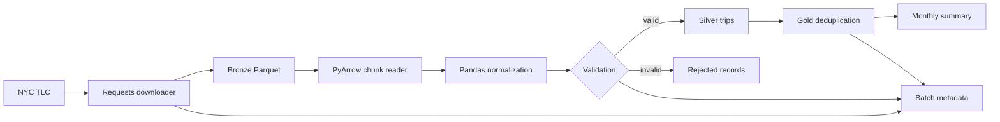

# Architecture

## Purpose and scope

The pipeline ingests monthly NYC TLC Yellow and Green taxi Parquet datasets.
The unit of work is one `(taxi_type, year, month)` batch. Python controls the
flow, the local filesystem retains raw files, and PostgreSQL stores validated,
curated, rejected, and operational data.

## Component flow



## Layers

### Bronze

Bronze files preserve the source Parquet data at:

```text
data/bronze/{taxi_type}/{year}/{month}/{taxi_type}_tripdata_YYYY-MM.parquet
```

Downloads first use a `.part` file and are renamed only after completion.
Existing files are reused unless `--overwrite` is supplied. A SHA-256 checksum
is stored in `pipeline.file_ingestions`.

### Silver

Yellow and Green use different source field names. `transform.py` maps both to
one canonical schema, explicitly converts numeric and datetime fields, and
adds:

- `taxi_type`
- `source_file`
- `source_year`
- `source_month`
- `ingested_at`
- `trip_key`

Before a rerun, existing Silver rows for the same taxi type and month are
deleted inside the new transaction. Silver therefore represents the latest
successful processing of that batch.

### Gold

Valid Silver rows are inserted into `gold.yellow_trips` or
`gold.green_trips`. `trip_key` is the primary key and promotion uses
`ON CONFLICT DO NOTHING`. Gold is cumulative and idempotent for an unchanged
business key.

`gold.monthly_summary` is a materialized view refreshed after every successful
batch.

## Validation

Rows are rejected when they contain:

- Missing pickup or drop-off timestamps
- Drop-off before pickup
- Missing pickup or drop-off location IDs
- Missing or negative trip distance
- Missing fare or total amount
- Negative passenger count

A rejected row is stored with its key, combined rejection reasons, JSON record,
and run ID. Missing required source columns fail the entire batch because they
usually indicate an upstream schema change or invalid input file.

## Transaction boundary

The following work uses one PostgreSQL transaction per monthly batch:

1. Replace that batch in Silver.
2. Insert rejected records.
3. Promote valid records to Gold.
4. Refresh the materialized summary.
5. Mark the run successful.

If any step fails, PostgreSQL rolls the whole monthly transaction back. The
previous successful Silver and Gold state remains intact. The run header is
created separately so a failure can remain visible.

This design favors consistency and simple recovery. Its main cost is a large
transaction, substantial WAL generation, and loss of all in-progress work if
PostgreSQL is restarted before commit.

## Reliability behavior

- Database connections wait through temporary PostgreSQL unavailability.
- A batch interrupted by a database connection failure is retried by the CLI.
- Gold primary keys prevent duplicates on rerun.
- A failed source file does not corrupt previously committed batches.
- Backfill continues with later months after a permanent batch failure.

Network download retries and distributed concurrency controls are not yet
implemented.

## Deployment topology

Docker Compose runs:

- `postgres`: persistent PostgreSQL 16 with a named data volume
- `pipeline`: an on-demand tool container on the Compose network

Inside Compose, PostgreSQL is addressed as `postgres`, not `localhost`.
`localhost` inside the pipeline container refers to the pipeline container
itself.
